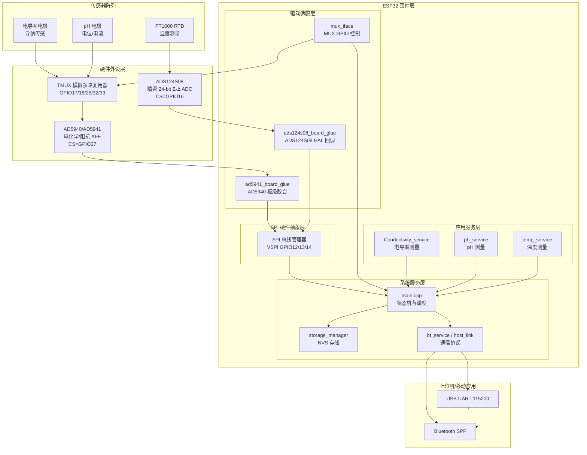

# 软件架构说明

> 文档版本：1.0
> 编写日期：2026-02-22
> 适用范围：AquaMonitor 水质监测仪嵌入式固件（ESP32 平台）

---

## 目录

1. [系统总体架构](#1-系统总体架构)
2. [固件整体架构](#2-固件整体架构)
   - 2.1 [模块划分与职责](#21-模块划分与职责)
   - 2.2 [任务与调度设计](#22-任务与调度设计)
   - 2.3 [模块间通信机制](#23-模块间通信机制)
3. [各功能模块详解](#3-各功能模块详解)
   - 3.1 [AD5940 驱动层](#31-ad5940-驱动层)
   - 3.2 [ADS124S08 驱动层](#32-ads124s08-驱动层)
   - 3.3 [TMUX 多路复用控制层](#33-tmux-多路复用控制层)
   - 3.4 [数据处理层](#34-数据处理层)
4. [对外通信接口](#4-对外通信接口)
   - 4.1 [物理层](#41-物理层)
   - 4.2 [协议格式](#42-协议格式)
   - 4.3 [命令列表](#43-命令列表)
5. [存储管理](#5-存储管理)
6. [GPIO 引脚分配总表](#6-gpio-引脚分配总表)

---

## 1. 系统总体架构

### 1.1 硬件-软件层次关系

系统采用 ESP32 微控制器作为主控单元，通过共享 SPI 总线连接两颗高性能模拟前端（AFE）芯片，配合模拟多路复用器实现多传感器分时接入。整体架构遵循分层设计原则，自底向上分为物理硬件层、驱动适配层、应用服务层和通信接口层。



### 1.2 数据流向与控制时序

测量数据从传感器到上位机的完整处理流程如下：

```
传感器物理信号
    │
    ▼
[TMUX 通道选择] ──GPIO 地址线──→ 模拟多路复用器（纳秒级切换）
    │
    ▼
[AD5940 / ADS124S08] ──SPI 总线──→ ESP32 读取原始 ADC 码值
    │
    ▼
[数据处理层] 信号调理、校准补偿、物理量换算
    │          │ 电导率：复数阻抗 → 电导率
    │          │ 温度：电阻 → 温度（Callendar-Van Dusen）
    │          │ pH：电流 → 电极电位 → pH（预留）
    ▼
[存储管理] NVS Flash 读写校准系数（上电加载，校准后保存）
    │
    ▼
[通信接口层] USB UART / Bluetooth SPP → 上位机（ASCII 文本协议）
```

**控制时序关键约束**：
1. MUX 通道切换必须在 AD5940 序列器初始化**之前**完成
2. AD5940 测量序列由内部 WUPT 定时器触发（电导率模式）或外部命令触发（pH 模式）
3. ADS124S08 采用连续转换模式，DRDY 信号轮询等待
4. 所有测量任务均在 `loop()` 单线程中协作执行，无抢占冲突

---

## 2. 固件整体架构

### 2.1 模块划分与职责

固件共包含 14 个软件模块，按功能层次分为四类：

#### 芯片驱动层

| 模块 | 源文件 | 职责说明 |
|------|--------|---------|
| AD5940 底层驱动 | `ad5940.c` | ADI 官方驱动库（约 4422 行纯 C），封装全部寄存器操作、序列发生器（Sequencer）编程、校准算法及复数运算原语 |
| AD5941 板级适配 | `ad5941_board_glue.cpp` | 将 AD5940 驱动所需的 6 个平台回调（SPI 读写、片选控制、延时、复位）与 ESP32 Arduino SPI 库绑定 |
| AD5941 平台配置 | `ad5941PlatformCfg.cpp` | 执行上电后的一次性平台级初始化：时钟配置（HFOSC 16/32 MHz）、SRAM 分区（FIFO 4 KB + 序列器 2 KB）、中断控制器配置 |
| ADS124S08 驱动 | `ads124s08_drv.cpp` | TI 精密 ADC 的完整 SPI 驱动，实现寄存器读写、软复位、转换启停及 24 位原始数据读取 |
| ADS124S08 板级适配 | `ads124s08_board_glue.cpp` | 以函数指针形式（HAL 回调结构体）将 ADS124S08 驱动与 ESP32 SPI 绑定，支持依赖注入 |

#### 硬件抽象层（HAL）

| 模块 | 源文件 | 职责说明 |
|------|--------|---------|
| SPI HAL | `spi_hal.h` | 纯 inline 实现的 SPI 总线抽象，管理 VSPI 总线共享及各从设备的 `SPISettings`（CS、速率、模式、位序） |
| TMUX 多路复用接口 | `mux_iface.cpp` | 通过 GPIO 地址线控制传感通道 MUX（2-bit，4 选 1）和 ISFET 通道 MUX（3-bit，8 选 1），实现无总线开销的纳秒级通道切换 |

#### 应用服务层

| 模块 | 源文件 | 职责说明 |
|------|--------|---------|
| 电导率服务 | `Conductivity_service.cpp` | 基于 AD5940 高速环路（HS Loop）的 AC 阻抗法电导率测量，含序列器程序生成、RTIA 自动校准、DFT 数据处理及电导率换算 |
| pH 服务 | `ph_service.cpp` | 基于 AD5940 低功耗环路（LP Loop）的直流电流法 pH 测量，含 LPDAC 偏置配置、LPTIA 电流检测及零点/增益校准 |
| 温度服务 | `temp_service.cpp` | 基于 ADS124S08 + PT1000 RTD 的比率法温度测量，包含 Callendar-Van Dusen 方程求解及三点多项式系统误差校准 |
| 游离氯服务 | `freecl_service.cpp` | 预留模块（当前为空实现），规划用于游离氯电化学检测 |

#### 系统服务层

| 模块 | 源文件 | 职责说明 |
|------|--------|---------|
| 主控逻辑 | `main.cpp` | 系统入口；执行顺序初始化、管理有限状态机（FSM）、解析串口命令、协调各服务模块 |
| 存储管理器 | `storage_manager.cpp` | 封装 ESP32 `Preferences`（NVS Flash）API，提供设备 ID、校准系数的持久化读写接口 |
| 蓝牙服务 | `bt_service.cpp` | 基于 Classic Bluetooth SPP 的无线通信服务，提供与串口协议格式兼容的命令收发接口 |
| 主机通信链路 | `host_link.cpp` | 预留的扩展通信协议层（当前为空实现） |

### 2.2 任务/线程设计

#### 2.2.1 调度模型选择

考虑到水质监测仪的实际应用场景——测量任务多为**秒级或更长周期**，且各测量模式（电导率、pH、温度）**互斥执行**（同一时刻仅一个传感器接入 AFE），本系统未采用实时操作系统（如 FreeRTOS）的多任务抢占式调度，而是基于 **Arduino 框架的单线程协作式模型**，通过**有限状态机（Finite State Machine, FSM）** 实现多测量模式的时分复用。该设计具有以下优势：

- **确定性**：无任务切换开销，时序可精确预测
- **资源节省**：无需 RTOS 内核内存（~6-10 KB RAM）和任务栈
- **避免资源竞争**：SPI、AD5940 序列器等关键外设无需互斥锁保护
- **简化调试**：无并发 bug（race condition, deadlock）

#### 2.2.2 执行流程与主循环

系统上电后执行一次性的初始化序列 `setup()`，随后进入 `loop()` 无限循环。每个循环迭代依次处理串口命令、检查定时事件、执行当前状态对应的测量/校准操作。

```c
// 伪代码示意主循环结构
void loop() {
    // 1. 命令解析（串口输入，非阻塞）
    if (Serial.available()) {
        handleSerialCommand();  // 解析文本命令 → 更新 currentState
    }

    // 2. 定时任务（500ms 周期，可用于未来扩展）
    static uint32_t last_ms = 0;
    if (millis() - last_ms > 500) {
        last_ms = millis();
        // 预留：定期状态上报、看门狗喂狗等
    }

    // 3. 状态机执行（协作式）
    switch (currentState) {
        case STATE_IDLE:
            break;  // 空转等待
        case STATE_TEMP_MEASURE:
            tempSvc.measure();  // 阻塞式温度测量（约 100ms）
            currentState = STATE_IDLE;
            break;
        case STATE_COND_MEASURE:
            AppCondISR();       // 轮询 AD5940 FIFO
            if (数据就绪) CondShowResult();
            // 保持 STATE_COND_MEASURE，等待下次循环继续轮询
            break;
        // ... 其他 13 个状态
    }
}
```

#### 2.2.3 有限状态机（FSM）设计

系统定义 15 个互斥状态，覆盖所有测量、校准和系统操作。状态转换完全由串口命令驱动，执行完毕后自动返回 `STATE_IDLE`，等待下一条命令。

```mermaid
stateDiagram-v2
    [*] --> STATE_IDLE

    STATE_IDLE --> STATE_TEMP_MEASURE: "temp read"
    STATE_IDLE --> STATE_TEMP_RESISTANCE: "temp resistance"
    STATE_IDLE --> STATE_TEMP_CAL_P1: "temp cal 25"
    STATE_IDLE --> STATE_TEMP_CAL_P2: "temp cal 35"
    STATE_IDLE --> STATE_TEMP_CAL_P3: "temp cal 50"
    STATE_IDLE --> STATE_TEMP_SAVE_CAL: "temp save"
    STATE_IDLE --> STATE_TEMP_RESET_CAL: "temp reset"

    STATE_IDLE --> STATE_COND_INIT: "cond init"
    STATE_IDLE --> STATE_COND_MEASURE: "cond read"
    STATE_IDLE --> STATE_COND_SWEEP: "cond sweep"
    STATE_IDLE --> STATE_COND_CAL: "cond cal"

    STATE_IDLE --> STATE_PH_INIT: "ph init"
    STATE_IDLE --> STATE_PH_MEASURE: "ph read"
    STATE_IDLE --> STATE_PH_CAL_OFFSET: "ph cal offset"
    STATE_IDLE --> STATE_PH_CAL_GAIN: "ph cal gain <R>"

    STATE_TEMP_MEASURE --> STATE_IDLE: 测量完成
    STATE_COND_MEASURE --> STATE_IDLE: 用户发送其他命令
    STATE_PH_MEASURE --> STATE_IDLE: 测量完成
    // 所有状态执行后均返回 IDLE
```



**状态说明**：
- **瞬时状态**：温度测量、pH 校准等操作在单次 `loop()` 中完成，立即返回 `STATE_IDLE`
- **持续状态**：电导率测量（`STATE_COND_MEASURE`）保持状态，在每次 `loop()` 中轮询 AD5940 FIFO，直到用户发送其他命令强制退出
- **初始化状态**：`STATE_COND_INIT`、`STATE_PH_INIT` 执行 AD5940 序列器生成与校准，耗时约 1-2 秒

#### 2.2.4 模式互斥与资源管理

AD5940 芯片的**序列器程序存储空间（2 KB SRAM）** 和**寄存器配置**在电导率模式与 pH 模式间不兼容，因此系统通过标志位实现严格互斥：

```c
// main.cpp 中的模式切换逻辑
if (进入电导率模式) {
    g_isCondMode = true;
    g_ispHMode = false;
    AppPHCfg.PHInited = FALSE;  // 强制 pH 服务重新初始化
}

if (进入 pH 模式) {
    g_ispHMode = true;
    g_isCondMode = false;
    AppCondCfg.CondInited = FALSE;  // 强制电导率服务重新初始化
}
```

任何测量命令执行前均检查对应 `*Inited` 标志，若为 `FALSE` 则报错并返回 `STATE_IDLE`，确保外设配置一致性。

### 2.3 模块间通信机制

固件内部各模块均在同一地址空间内运行，通信通过以下机制实现：

#### 函数调用（同步）

主要控制路径：`main.cpp` 通过直接函数调用驱动各服务模块，调用完成后立即返回结果。

```
main.cpp
  ├─ AppCondInit()  → Conductivity_service.cpp
  ├─ AppPHInit()    → ph_service.cpp
  ├─ TempService::measure() → temp_service.cpp → ads124s08_drv.cpp
  └─ ChooseSenesingChannel() → mux_iface.cpp
```

#### 全局配置结构体（共享内存）

各服务模块通过全局结构体对外暴露可配置参数，主控模块通过 `GetCfg()` 接口获取指针后修改：

| 结构体 | 归属模块 | 关键字段 |
|--------|---------|---------|
| `AppCondCfg` | 电导率服务 | 激励频率、幅度、RTIA 档位、K_Cell 常数 |
| `AppPHCfg` | pH 服务 | LPDAC 偏置码、RTIA 值、ADC 零点偏移 |

#### 硬件中断模拟（轮询）

AD5940 的 FIFO 数据就绪本应通过硬件中断（GP0 引脚→ESP32 外部中断）通知 MCU，但本固件**将中断回调替换为空函数**（`AD5940_GetMCUIntFlag()` 恒返回 0），改为在 `loop()` 中**周期性轮询**调用 `AppCondISR()` / `AppPHISR()`，由这两个函数内部通过 SPI 读取 AD5940 的 INTC 状态寄存器判断数据是否就绪。

```
loop()
  │  STATE_COND_MEASURE
  └─── AppCondISR(AppBuff, &count)   // 每次 loop 调用
         │
         ├─ SPI → 读 INTC0 状态寄存器
         ├─ 若 DATAFIFOTHRESH 置位：
         │     读 FIFO → 解码 DFT 数据 → return count > 0
         └─ 否则：直接 return 0
```

---

## 3. 各功能模块详解

### 3.1 AD5940 驱动层

#### 3.1.1 模块概述

AD5940/AD5941 是 ADI 公司的高精度电化学/阻抗测量模拟前端芯片，集成了可编程正弦波发生器（HSDAC + WG）、高速跨阻放大器（HSTIA）、低功耗电位器（LP-PA + LPTIA）、16 位 ADC、DFT 硬件加速器及片内 SRAM 序列器。本系统中，AD5940 同时承担**电导率测量**（高速环路 HS Loop）和 **pH 电流测量**（低功耗环路 LP Loop）两种功能，通过互斥标志实现分时复用。

#### 3.1.2 软件分层结构

```
┌─────────────────────────────────────────────────┐
│         应用服务层（Conductivity / pH Service）    │
│   AppCondInit / AppCondISR / AppPHInit / AppPHISR│
├─────────────────────────────────────────────────┤
│       平台配置层（ad5941PlatformCfg.cpp）          │
│   时钟初始化 / FIFO 分区 / 中断控制器配置           │
├─────────────────────────────────────────────────┤
│         ADI 官方驱动库（ad5940.c）                 │
│  ~100 个函数：寄存器读写、序列器、校准、复数运算      │
├─────────────────────────────────────────────────┤
│       板级适配层（ad5941_board_glue.cpp）           │
│   SPI CS / 读写 / 延时 / 复位 → ESP32 Arduino SPI │
└─────────────────────────────────────────────────┘
```

#### 3.1.3 片内资源分配

| 资源 | 总量 | FIFO | 序列器 SRAM |
|------|------|------|------------|
| 片内 SRAM | 6 KB | 4 KB（`FIFOThresh=4`） | 2 KB |
| 序列器 ID | 2 个 | `SEQID_1`：初始化序列 | `SEQID_0`：测量序列 |

#### 3.1.4 电导率测量工作原理

电导率测量采用**两端交流阻抗法**，配置参数如下：

| 参数 | 默认值 | 说明 |
|------|--------|------|
| 激励频率 | 50 kHz | 正弦波激励，避开低频极化干扰 |
| 激励幅度 | 600 mVpp | HSDAC + 激励放大器输出 |
| RTIA | 1 kΩ (HSTIARTIA_1K) | 电流检测量程 |
| ADC 时钟 | 16/32 MHz | < 20 kHz 用 16 MHz，≥ 20 kHz 切换至 32 MHz 高功耗模式 |
| DFT 点数 | 8192 点 | DFTNUM_8192，加汉宁窗减少频谱泄漏 |
| FIFO 阈值 | 4 个 uint32_t | 对应一次完整测量的 DFT 实部/虚部四值 |
| 输出数据率 | 20 Hz | 唤醒定时器（WUPT）周期 50 ms |

**测量序列执行流程**（写入 AD5940 内部 SRAM，由硬件自动执行）：

```
WUPT 定时器触发（50 ms）
    ↓
SEQID_0 自动执行：
  ① 开关矩阵 → 接通传感器（D=CE0, P=CE0, N=AIN0）
  ② 等待稳定（约 250 μs）
  ③ ADC MUX → HSTIA_P/N （测电流 I = V_HSTIA / Z_RTIA）
     WG + ADC + DFT 启动 → 等待 DFT 完成 → 关闭
  ④ ADC MUX → VCE0/N_NODE（测电压 V）
     WG + ADC + DFT 启动 → 等待 DFT 完成 → 关闭
  ⑤ 开关矩阵浮空 → AFE 进入休眠
    ↓
FIFO 数据就绪（4 个 DFT 结果）
    ↓
AppCondISR() 轮询读取 → AppCondDataProcess() 计算阻抗
```

**阻抗与电导率计算**：

从 FIFO 读取的 4 个 18 位补码值（需符号扩展）表示两路 DFT 测量结果：

```
[DFT_I_Real, DFT_I_Imag, DFT_V_Real, DFT_V_Imag]

I_复数 = DFT_Curr / Z_RTIA（校准后复阻抗）
Z_传感器 = DFT_Volt / I_复数

G（电导）  = Re(Z) / |Z|²        [单位：S]
电导率      = G × 10⁶ × K_Cell   [单位：μS/cm]
```

其中 `K_Cell` 为电极常数（cm⁻¹），由标准液校准实验确定。

#### 3.1.5 pH 测量工作原理

pH 测量使用 AD5940 的低功耗直流测量环路：

| 参数 | 值 | 说明 |
|------|---|------|
| LPDAC Vbias | ≈ 1.135 V（0x745/4096 × 2.5V）| 工作电极偏置 |
| LPDAC Vzero | ≈ 0.898 V（0x17/64 × 2.5V）| 参比/对电极参考 |
| LPTIA RTIA | 200 Ω（LPTIARTIA_200R）| 电流检测量程 |
| FIFO 源 | FIFOSRC_SINC3 | 直流测量无需 DFT |
| ADC 时钟 | 1.6 MHz | SINC3 OSR=4，SINC2 OSR=22 |

电流计算公式：

```
rawCode   = FIFO 低 16 位
diff_code = rawCode − ZeroOffset_Code（需零点校准）
V_diff    = diff_code / 32768 × 1.82 V
I         = −V_diff / Rtia_Ω
```

#### 3.1.6 对外接口

| 接口函数 | 功能 |
|---------|------|
| `AD5941PlatformCfg()` | 平台级初始化（上电调用一次） |
| `AppCondCfg_init()` / `AppPHCfg_init()` | 加载服务默认参数 |
| `AppCondInit(buf, size)` / `AppPHInit(buf, size)` | 初始化序列器并启动 AFE |
| `AppCondISR(buf, &cnt)` / `AppPHISR(buf, &cnt)` | 轮询读取 FIFO 测量数据 |
| `AppCondCtrl(cmd, para)` / `AppPHCtrl(cmd, para)` | 控制指令（START/STOP/SHUTDOWN） |
| `CondShowResult(data, n)` / `PHShowResult(data, n)` | 解码并输出测量结果 |

---

### 3.2 ADS124S08 驱动层

#### 3.2.1 模块概述

ADS124S08 是 TI 的 24 位精密 Σ-Δ ADC，本系统中专用于**PT1000 铂热电阻温度测量**，采用**比率法（Ratiometric）**消除激励电流绝对精度对测量结果的影响。

#### 3.2.2 软件分层结构

```
┌──────────────────────────────────────────────────┐
│       应用层  TempService（C++ 类）                 │
│  measure() → readResistance() → resistanceToTemp()│
│  三点多项式校准：recordCalibPoint() / finish()     │
├──────────────────────────────────────────────────┤
│       驱动层  ADS124S08_Drv（C++ 类）              │
│  softReset / start / stop / readData             │
│  readRegisters / writeRegisters（SPI 命令层）     │
├──────────────────────────────────────────────────┤
│    平台适配层  BoardGlue（ads124s08_board_glue）   │
│  make_ads_hal()：6 个 HAL 函数指针封装            │
│  { cs_assert, cs_release, spi_txrx,              │
│    delay_us, delay_ms, read_drdy }               │
├──────────────────────────────────────────────────┤
│       SPI 抽象层  SpiDevice / SpiHAL              │
│  Arduino SPI.beginTransaction / transfer         │
└──────────────────────────────────────────────────┘
```

#### 3.2.3 硬件连接与 ADC 配置

**比率法连接拓扑**：

```
ADS124S08
┌──────────────┐
│ IDAC → AIN0  ├──── 500 μA 激励电流
│              │         │
│              │    R_ref = 3300 Ω（参比电阻）
│              │         │
│ AIN1（V+）  ├──────── PT1000 高端
│              │         │  PT1000 = R(T) ≈ 1000～1200 Ω（0～50°C）
│ AIN2（V−）  ├──────── PT1000 低端
│              │         │
│ AGND        ├─────────┘
└──────────────┘

ADC 参考电压 = I × R_ref（自动追踪激励电流变化）
ADC 差分输入 = I × R_PT1000
比值 = R_PT1000 / R_ref → 消除 IDAC 误差
```

**关键寄存器配置**：

| 寄存器 | 配置值 | 说明 |
|--------|--------|------|
| INPMUX | `0x12` | 差分输入：AINP=AIN1，AINN=AIN2 |
| PGA | `0x09` | PGA 使能，增益 × 2 |
| DATARATE | `0x14` | 连续转换模式，20 SPS |
| IDACMAG | `0x05` | IDAC 激励电流 = 500 μA |
| SYS | `0x10` | 关闭 SENDSTAT 和 CRC |

#### 3.2.4 温度计算算法

**第一步：码值转电阻（比率法）**

```
R_PT1000 = (code_24bit / 2²³) × R_ref / PGA_gain
         = (code_24bit / 8388608) × 3300 / 2
```

**第二步：电阻转温度（Callendar-Van Dusen 方程，IEC 60751）**

- T ≥ 0°C，解析解：

```
R(T) = R₀(1 + AT + BT²)

T = [−A + √(A² − 4B·(1 − R/R₀))] / (2B)

其中：A = 3.9083×10⁻³ /°C，B = −5.775×10⁻⁷ /°C²，R₀ = 1000 Ω
```

- T < 0°C，Newton-Raphson 迭代法（最多 10 次，收敛精度 0.001 Ω）

**第三步：三点多项式系统误差校准**

在三个标定温度点（默认 25°C、35°C、50°C）采集测量值，建立二次多项式校正模型：

```
T_true = a × T_meas² + b × T_meas + c

构造 3×3 线性方程组，高斯消元法求解系数 {a, b, c}，
校准系数持久化存入 NVS Flash。
```

#### 3.2.5 SPI 通信时序

| 操作 | 命令字节 | 数据传输 |
|------|---------|---------|
| 软复位 | `0x06` | 无 |
| 开始转换 | `0x08` | 无 |
| 停止转换 | `0x0A` | 无 |
| 读 n 寄存器 | `0x20 \| addr`, `n−1` | 接收 n 字节 |
| 写 n 寄存器 | `0x40 \| addr`, `n−1`, data... | 无 |
| 读数据 | `0x12`, 10 μs 延迟 | 接收 3 字节（24 位，MSB 优先） |

DRDY（GPIO4）低电平有效，数据就绪信号采用**轮询方式**等待（超时 100 ms）。

---

### 3.3 TMUX 多路复用控制层

#### 3.3.1 模块概述

系统配置两个模拟多路复用器，通过 GPIO 地址线控制，实现多传感器共享 AFE 信号路径，无需额外 SPI/I2C 通信开销。

#### 3.3.2 传感通道 MUX（MUX-A，2-bit，4 选 1）

用于在电导率、余氯、pH 三路差分传感器之间切换，控制引脚为 GPIO17（ADDR0）和 GPIO18（ADDR1）。

| ADDR1 | ADDR0 | 选中通道 | 接入传感器 |
|-------|-------|---------|----------|
| 0 | 0 | S1A/S1B | 电导率电极（阻抗测量） |
| 0 | 1 | S2A/S2B | 余氯传感器 |
| 1 | 0 | S3A/S3B | pH 电极 |
| 1 | 1 | S4A/S4B | 预留 |

通道切换为差分双路同步切换（A/B 端同时动作），确保差分信号路径一致性。

#### 3.3.3 ISFET 通道 MUX（MUX-B，3-bit，8 选 1）

用于在最多 8 路 ISFET（离子敏感场效应晶体管）传感器阵列中轮询选择，控制引脚为 GPIO32（ADDR0）、GPIO33（ADDR1）、GPIO25（ADDR2）。

| ADDR[2:0] | 选中通道 |
|-----------|---------|
| 000 | ISFET S1 |
| 001 | ISFET S2 |
| ... | ... |
| 111 | ISFET S8 |

#### 3.3.4 控制接口

```c
void MUXPinInit(void);                     // 初始化 GPIO 方向，置默认通道 CH1
void ChooseSenesingChannel(int channel);   // 切换传感通道（1~3）
void ChooseISFETChannel(int channel);      // 切换 ISFET 通道（1~8）
```

#### 3.3.5 与测量流程的协作

MUX 切换必须发生在 AD5940 初始化**之前**，以确保序列器生成时信号路径已确定：

```
串口命令到达
    ↓
ChooseSenesingChannel(N)   ← 步骤 1：切换 MUX 通道
    ↓
AppCondInit() / AppPHInit()← 步骤 2：重新生成序列器
    ↓
AppCondCtrl(START) / AppPHCtrl(START) ← 步骤 3：启动采集
```

---

### 3.4 数据处理层

数据处理分散在各服务模块中，按测量参量分述如下。

#### 3.4.1 电导率数据处理链

```
AD5940 FIFO（4 × uint32_t）
    │  bit[17]=符号位，18 位补码符号扩展
    ▼
DFT 复数解码
    DFT_Curr = {−pData[0], −pData[1]}   // 取反：修正电流方向 + ADI 虚部符号约定
    DFT_Volt = { pData[2],  pData[3]}
    │
    ▼
RTIA 校准补偿
    I = DFT_Curr / Z_RTIA（校准复阻抗）
    │
    ▼
阻抗计算
    Z = DFT_Volt / I  （复数除法）
    │
    ▼
电导率换算
    G_μS = Re(Z) / |Z|² × 10⁶
    Conductivity = G_μS × K_Cell  [μS/cm]
```

#### 3.4.2 温度数据处理链

```
ADS124S08（24 位有符号 ADC 码值）
    │  符号扩展：bit[23] → bit[31]
    ▼
比率法转电阻
    R = code / 8388608 × 3300 / 2  [Ω]
    │
    ▼
Callendar-Van Dusen 转温度
    T ≥ 0°C: 解析解（二次方程求根）
    T < 0°C: Newton-Raphson 迭代（10次）
    │
    ▼
多项式校准补偿
    T_out = a·T² + b·T + c
    （无校准数据时直通）
```

#### 3.4.3 pH 数据处理链

```
AD5940 FIFO（1 × uint32_t，SINC3 输出）
    │  取低 16 位有效码值
    ▼
零点偏移补偿
    diff_code = rawCode − ZeroOffset_Code（NVS 存储）
    │
    ▼
电压转换
    V_diff = diff_code / 32768 × 1.82 V
    │
    ▼
电流计算
    I_μA = −V_diff / Rtia × 10⁶
    │
    ▼（预留，待实现）
Nernst 方程转 pH 值
    pH = pH_ref − (V_electrode − E_ref) / 0.05916
```

---

## 4. 对外通信接口

### 4.1 物理层

系统提供两条通信信道，协议格式完全兼容，上位机可按需选择。

#### 4.1.1 USB UART（主信道，已集成）

| 参数 | 值 |
|------|---|
| 接口 | ESP32 UART0（通过 USB-UART 桥芯片引出） |
| 波特率 | 115200 bps |
| 数据位 | 8 位 |
| 校验位 | 无（N） |
| 停止位 | 1 位 |
| 当前状态 | 主要通信信道，已在 `main.cpp` 中完整集成 |

#### 4.1.2 Bluetooth SPP（扩展信道，已实现未集成）

| 参数 | 值 |
|------|---|
| 接口 | ESP32 内置 Classic Bluetooth，SPP Profile |
| 协议库 | `BluetoothSerial`（ESP32 Arduino Core 内置） |
| 设备名称 | 由 `BTService_Init(deviceName)` 参数指定 |
| 当前状态 | `bt_service.cpp` 已完整实现，`main.cpp` 暂未调用，作为备用/无线扩展通道 |

两信道对外呈现完全相同的**命令/响应文本协议**，后续可通过在 `loop()` 中添加 `BTService_ReadCommand()` 调用实现双信道并行接入。

### 4.2 协议格式

#### 4.2.1 帧结构

系统采用**纯 ASCII 文本行协议**，无二进制封装、无固定包头、无 CRC 校验。

```
命令帧（上位机 → ESP32）：
┌─────────────────────────────────────┬────┐
│    命令字符串（ASCII 可打印字符）      │ \n │
└─────────────────────────────────────┴────┘

响应帧（ESP32 → 上位机）：
┌─────────────────────────────────────┬────┐
│    响应文本行 1（ASCII）              │ \n │
├─────────────────────────────────────┼────┤
│    响应文本行 2（可能为多行）          │ \n │
└─────────────────────────────────────┴────┘
```

#### 4.2.2 协议特性

| 特性 | 说明 |
|------|------|
| 编码 | ASCII 纯文本 |
| 行结束符 | LF（`\n`），接收端执行 `trim()` 后匹配 |
| 多行响应 | 允许，以最终结果行或 `>>>...<<<` 标记为结束 |
| 确认机制 | 无握手、无 ACK/NAK（单向无确认） |
| 错误提示 | 以明文字符串直接返回错误描述 |
| 数值格式 | `Serial.printf` 浮点格式，精度由各服务模块指定 |

### 4.3 命令列表

#### 4.3.1 温度类命令

| 命令 | 功能描述 | 响应示例 |
|------|---------|---------|
| `temp read` | 读取当前水温（°C） | `Water Temp: 25.123456` |
| `temp resistance` | 读取 PT1000 原始电阻值（调试用） | `Resistance: 1097.32 Ohm` |
| `temp cal 25` | 在 25°C 标准浴中采集校准点 1 | `Point 1 Saved!` |
| `temp cal 35` | 在 35°C 标准浴中采集校准点 2 | `Point 2 Saved!` |
| `temp cal 50` | 在 50°C 标准浴中采集校准点 3 | `Point 3 Saved!` |
| `temp save` | 计算三点多项式系数并写入 NVS | `Calibration DONE! a=..., b=..., c=...` |
| `temp reset` | 清除温度校准系数，恢复出厂值 | `Calibration Cleared.` |

#### 4.3.2 电导率类命令

| 命令 | 功能描述 | 响应示例 |
|------|---------|---------|
| `cond init` | 初始化 AD5940 电导率测量序列器，执行 RTIA 校准 | `Conductivity Service Init OK!` |
| `cond read` | 单次 50 kHz 阻抗测量，计算并输出电导率 | `Conductivity: 1413.0000` |
| `cond sweep` | 频率扫描（1 kHz → 100 kHz，100 点）输出 EIS 谱 | 多行阻抗数据 → `>>> Sweep Completed! <<<` |
| `cond cal` | 浸入已知浓度标准液后执行电极常数 K_Cell 校准 | `>>> Calibration Successful! <<< K_Cell=1.023` |

#### 4.3.3 pH 类命令

| 命令 | 功能描述 | 响应示例 |
|------|---------|---------|
| `ph init` | 初始化 AD5940 低功耗环路，配置 LPDAC 偏置 | `pH Service Init OK!` |
| `ph read` | 单次测量，输出电极电流（μA） | 电流值（由 `PHShowResult` 格式化）|
| `ph cal offset` | 在缓冲液中校准 ADC 零点偏移码，写入 NVS | `>>> Offset Calibrated! New Zero Code: 32768 <<<` |
| `ph cal gain <ohms>` | 接入已知精度电阻校准 RTIA 增益，写入 NVS | `>>> Gain Calibrated! New RTIA: 985.23 Ohm <<<` |

#### 4.3.4 系统类命令

| 命令 | 功能描述 | 响应示例 |
|------|---------|---------|
| `id <number>` | 设置设备 ID 并写入 NVS（仅首次配置时有效） | `Device ID saved: 1` |
| `factory reset` | 恢复全部参数为出厂默认值 | `>>> Factory Reset Complete. <<<` |

#### 4.3.5 错误响应

| 错误场景 | 错误响应 |
|---------|---------|
| 在非电导率模式下发 `cond read/cal/sweep` | `Not in Conductivity Mode` |
| 在非 pH 模式下发 `ph read/cal*` | `Not in pH Mode` |
| 电导率服务未初始化就测量 | `Conductivity Service haven't been initialized` |
| pH 服务未初始化就测量 | `pH Service haven't been initialized` |
| ADS124S08 初始化验证失败 | `!!! ADS124S08 configuration FAILED! Halting. !!!`（系统停止） |
| pH 增益校准时信号过低 | `>>> Error: Signal too low (0.0000V). Is resistor connected? <<<` |

---

## 5. 存储管理

固件使用 ESP32 内置 NVS（Non-Volatile Storage）Flash 进行参数持久化，通过 Arduino `Preferences` 库访问，命名空间为 `"dev"`。

| NVS Key | 数据类型 | 含义 | 默认值 |
|---------|---------|------|--------|
| `"id"` | int | 设备 ID | 0（未设置）|
| `"cond_k"` | float | 电导率电极常数 K_Cell（cm⁻¹） | 1.0 |
| `"ph_off"` | uint16 | pH ADC 零点偏移码 | 32768 |
| `"ph_rtia"` | float | pH RTIA 增益电阻值（Ω） | 1000.0 |
| `"temp_a"` | float | 温度校准二次项系数 a | 0.0 |
| `"temp_b"` | float | 温度校准一次项系数 b | 1.0 |
| `"temp_c"` | float | 温度校准常数项系数 c | 0.0 |
| `"temp_v"` | bool | 温度校准是否有效 | false |

上电初始化时，所有参数从 NVS 读入 RAM；校准完成时立即写入 NVS，保证掉电不丢失。

---

## 6. GPIO 引脚分配总表

| GPIO | 功能名称 | 方向 | 电气说明 |
|------|---------|------|---------|
| 4 | DRDY_ADS124S08 | 输入 | ADS124S08 数据就绪，低有效，轮询检测 |
| 12 | SPI_MISO | 输入 | VSPI 总线 MISO，AD5940 + ADS124S08 共享 |
| 13 | SPI_MOSI | 输出 | VSPI 总线 MOSI |
| 14 | SPI_SCLK | 输出 | VSPI 总线时钟 |
| 15 | RESET_ADS124S08 | 输出 | ADS124S08 硬件复位，低脉冲 ≥ 10 μs |
| 16 | CS_ADS124S08 | 输出 | ADS124S08 片选，低有效，SPI MODE1，4 MHz |
| 17 | CHANNEL_MUX_ADDR0 | 输出 | 传感通道 MUX 地址位 0 |
| 18 | CHANNEL_MUX_ADDR1 | 输出 | 传感通道 MUX 地址位 1 |
| 25 | ISFET_MUX_ADDR2 | 输出 | ISFET MUX 地址位 2 |
| 26 | RESET_AD5941 | 输出 | AD5941 硬件复位，低有效 |
| 27 | CS_AD5941 | 输出 | AD5941 片选，低有效，SPI MODE0，8 MHz |
| 32 | ISFET_MUX_ADDR0 | 输出 | ISFET MUX 地址位 0 |
| 33 | ISFET_MUX_ADDR1 | 输出 | ISFET MUX 地址位 1 |
| TX0/RX0 | UART0 | 双向 | USB-UART 桥，115200-8N1 |

---

*本文档根据 AquaMonitor 固件源代码（`src/`、`include/` 目录）分析整理，适用于毕业论文技术实现章节引用。*
